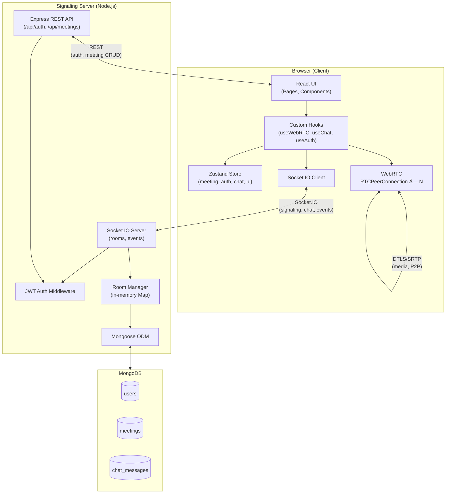

# Design Document: Video Conferencing App

## Overview

This document describes the technical design for transforming the existing 1-to-1 WebRTC skeleton into a production-quality, Google Meet-like video conferencing platform. The system supports up to 8 simultaneous participants using a full-mesh WebRTC topology, real-time chat with MongoDB persistence, screen sharing, host admin controls, a waiting room, JWT authentication, and a polished dark UI.

The architecture is a three-tier MERN stack:

- **Client** — React 19 / Vite SPA with Tailwind CSS v4, Zustand, Socket.IO client, and the WebRTC browser API.
- **Signaling Server** — Node.js / Express / Socket.IO backend handling WebRTC signaling, REST API, JWT auth middleware, and MongoDB integration via Mongoose.
- **Database** — MongoDB storing Meeting documents, Chat_Message documents, and User documents.

### Key Design Decisions

| Decision | Choice | Rationale |
|---|---|---|
| WebRTC topology | Full mesh (P2P) | Simplest for ≤8 peers; no SFU infrastructure needed for MVP |
| Signaling transport | Socket.IO | Already in use; handles rooms, namespaces, and reconnection |
| State management | Zustand | Already in use; minimal boilerplate, fine-grained subscriptions |
| Auth token storage | In-memory (React state / closure) | Prevents XSS token theft vs. localStorage |
| Chat persistence | MongoDB via Mongoose | Structured queries, easy indexing on `meetingId` + `timestamp` |
| Screen share | `getDisplayMedia` + `RTCRtpSender.replaceTrack` | No renegotiation needed; seamless track swap |
| PBT library | `fast-check` (client) | Mature, TypeScript-friendly, runs in Vitest |

---

## Architecture

### System Architecture Diagram



### Request / Connection Lifecycle

```mermaid
sequenceDiagram
    participant A as Participant A (Browser)
    participant S as Signaling Server
    participant B as Participant B (Browser)
    participant DB as MongoDB

    A->>S: POST /api/meetings (create)
    S->>DB: insert Meeting document
    S-->>A: { meetingId, shareUrl }

    A->>S: Socket connect (JWT in handshake)
    S->>S: verify JWT middleware
    A->>S: emit join-room { meetingId, displayName }
    S->>DB: upsert participant in Meeting

    B->>S: Socket connect (JWT in handshake)
    B->>S: emit join-room { meetingId, displayName }
    S-->>A: emit user-joined { socketId, displayName }

    A->>A: createOffer (RTCPeerConnection)
    A->>S: emit offer { sdp, targetSocketId }
    S-->>B: emit offer { sdp, fromSocketId }
    B->>B: setRemoteDescription, createAnswer
    B->>S: emit answer { sdp, targetSocketId }
    S-->>A: emit answer { sdp, fromSocketId }
    A->>A: setRemoteDescription

    A-->B: ICE candidates exchanged via server
    A<-->B: DTLS/SRTP media (P2P, bypasses server)
```

---

## Components and Interfaces

### File Structure

```
client/src/
├── App.jsx                          # Router: auth guard → Home | Meeting | Auth pages
├── main.jsx
├── index.css
│
├── pages/
│   ├── Home.jsx                     # Landing: create / join meeting
│   ├── MeetingRoom.jsx              # Main meeting view (orchestrates panels)
│   ├── PreJoinLobby.jsx             # Camera preview + display name entry
│   ├── WaitingRoom.jsx              # "Waiting for host" screen
│   ├── RemovedScreen.jsx            # "You were removed" screen
│   ├── MeetingNotFound.jsx          # 404 meeting error page
│   ├── Login.jsx                    # JWT login form
│   └── Register.jsx                 # JWT register form
│
├── components/
│   ├── layout/
│   │   └── MeetingLayout.jsx        # Shell: VideoGrid + sidepanels + ControlBar
│   ├── video/
│   │   ├── VideoGrid.jsx            # Responsive CSS grid of Tiles
│   │   ├── Tile.jsx                 # Single participant tile (video or avatar)
│   │   ├── VideoPlayer.jsx          # <video> element wrapper
│   │   └── AvatarFallback.jsx       # Initials avatar when camera is off
│   ├── controls/
│   │   └── ControlBar.jsx           # Bottom toolbar with all action buttons
│   ├── chat/
│   │   ├── ChatPanel.jsx            # Collapsible right-side chat panel
│   │   ├── ChatMessage.jsx          # Single message bubble
│   │   └── ChatInput.jsx            # Message input + send button
│   ├── participants/
│   │   ├── ParticipantsPanel.jsx    # Collapsible right-side participants list
│   │   └── ParticipantRow.jsx       # Single participant row with status icons
│   ├── waiting/
│   │   └── AdmissionPanel.jsx       # Host's panel showing waiting participants
│   ├── notifications/
│   │   └── NotificationStack.jsx    # Toast notification stack (bottom of screen)
│   └── ui/
│       ├── ConfirmDialog.jsx        # Escape-to-leave confirmation modal
│       ├── SkeletonTile.jsx         # Loading skeleton for tiles
│       └── CopyLinkButton.jsx       # Share URL copy-to-clipboard button
│
├── hooks/
│   ├── useWebRTC.js                 # Mesh peer connection management (refactored)
│   ├── useChat.js                   # Chat send/receive + history fetch
│   ├── useAuth.js                   # JWT login/register/token management
│   ├── useScreenShare.js            # getDisplayMedia + track replacement
│   ├── useParticipants.js           # Participant list state + events
│   ├── useNotifications.js          # Toast queue management
│   └── useKeyboardShortcuts.js      # M, V, H, Escape bindings
│
└── store/
    ├── useMeetingStore.js           # Meeting + WebRTC state (refactored)
    ├── useAuthStore.js              # JWT token + user identity
    ├── useChatStore.js              # Chat messages + unread count
    └── useUIStore.js                # Panel visibility, notifications, dialogs

server/
├── index.js                         # Entry point: Express + Socket.IO bootstrap
├── config/
│   └── db.js                        # Mongoose connect + error handling
├── models/
│   ├── User.js                      # Mongoose User schema
│   ├── Meeting.js                   # Mongoose Meeting schema
│   └── ChatMessage.js               # Mongoose ChatMessage schema
├── routes/
│   ├── auth.js                      # POST /api/auth/register, /api/auth/login
│   └── meetings.js                  # GET /api/meetings/:id, GET /api/meetings/:id/chat
├── middleware/
│   └── auth.js                      # JWT verification middleware
├── socket/
│   ├── index.js                     # Socket.IO server setup + auth middleware
│   ├── roomHandlers.js              # join-room, user-joined, user-left, host logic
│   ├── signalingHandlers.js         # offer, answer, ice-candidate
│   ├── mediaHandlers.js             # participant-media-state, screen-share events
│   ├── chatHandlers.js              # chat-message relay + DB persist
│   ├── handHandlers.js              # raise-hand, lower-hand
│   ├── adminHandlers.js             # kick-participant, host-changed
│   └── waitingRoomHandlers.js       # waiting, admit, deny
└── utils/
    └── meetingId.js                 # Meeting ID generator (abc-defg-hij format)
```

### Component Interface Contracts

#### `<Tile>` Props
```typescript
interface TileProps {
  participantId: string;
  displayName: string;
  stream: MediaStream | null;
  isLocal: boolean;
  isHost: boolean;
  isMuted: boolean;
  isCameraOff: boolean;
  isHandRaised: boolean;
  isDominantSpeaker: boolean;
  isScreenSharing: boolean;
  isLoading: boolean;           // shows SkeletonTile while PC establishing
  onKick?: () => void;          // only provided when viewer is host
}
```

#### `<ControlBar>` Props
```typescript
interface ControlBarProps {
  isMicOn: boolean;
  isCamOn: boolean;
  isHandRaised: boolean;
  isScreenSharing: boolean;
  isChatOpen: boolean;
  isParticipantsOpen: boolean;
  unreadChatCount: number;
  participantCount: number;
  onToggleMic: () => void;
  onToggleCam: () => void;
  onToggleHand: () => void;
  onToggleScreenShare: () => void;
  onToggleChat: () => void;
  onToggleParticipants: () => void;
  onLeave: () => void;
}
```

#### `useWebRTC` Hook Interface
```typescript
interface UseWebRTCReturn {
  peerConnections: Map<string, RTCPeerConnection>;
  connectionStates: Map<string, RTCIceConnectionState>;
  replaceVideoTrack: (newTrack: MediaStreamTrack) => Promise<void>;
  restartIce: (peerId: string) => Promise<void>;
}
```

---

## Data Models

### MongoDB Schemas

#### User
```javascript
// server/models/User.js
const UserSchema = new mongoose.Schema({
  email:        { type: String, required: true, unique: true, lowercase: true, trim: true },
  passwordHash: { type: String, required: true },           // bcrypt, cost factor ≥ 12
  displayName:  { type: String, required: true, maxlength: 50 },
  createdAt:    { type: Date, default: Date.now },
});
```

#### Meeting
```javascript
// server/models/Meeting.js
const MeetingSchema = new mongoose.Schema({
  meetingId:        { type: String, required: true, unique: true, index: true },
  hostSocketId:     { type: String, required: true },
  hostUserId:       { type: mongoose.Schema.Types.ObjectId, ref: 'User', default: null },
  createdAt:        { type: Date, default: Date.now },
  endedAt:          { type: Date, default: null },
  participantCount: { type: Number, default: 0 },
  waitingRoomEnabled: { type: Boolean, default: false },
});
```

#### ChatMessage
```javascript
// server/models/ChatMessage.js
const ChatMessageSchema = new mongoose.Schema({
  meetingId:   { type: String, required: true, index: true },
  senderName:  { type: String, required: true, maxlength: 50 },
  text:        { type: String, required: true, maxlength: 1000 },
  timestamp:   { type: Date, default: Date.now },
});
// Compound index for efficient history queries
ChatMessageSchema.index({ meetingId: 1, timestamp: 1 });
```

### Zustand Store Shape

```typescript
// useMeetingStore.js
interface MeetingState {
  // Identity
  meetingId: string | null;
  localSocketId: string | null;
  displayName: string;
  isHost: boolean;

  // Media streams
  localStream: MediaStream | null;
  screenShareStream: MediaStream | null;
  remoteStreams: Map<string, MediaStream>;       // socketId → stream

  // Participant metadata (synced via socket events)
  participants: Map<string, ParticipantMeta>;   // socketId → meta

  // Connection state per peer
  connectionStates: Map<string, 'connecting' | 'connected' | 'failed'>;

  // Local media state
  isMicOn: boolean;
  isCamOn: boolean;
  isScreenSharing: boolean;
  isHandRaised: boolean;

  // Actions
  setLocalStream: (stream: MediaStream) => void;
  setRemoteStream: (socketId: string, stream: MediaStream) => void;
  removeRemoteStream: (socketId: string) => void;
  upsertParticipant: (socketId: string, meta: ParticipantMeta) => void;
  removeParticipant: (socketId: string) => void;
  setConnectionState: (socketId: string, state: string) => void;
  toggleMic: () => void;
  toggleCam: () => void;
  setScreenSharing: (active: boolean) => void;
  toggleHand: () => void;
  setHost: (socketId: string) => void;
}

interface ParticipantMeta {
  socketId: string;
  displayName: string;
  isMuted: boolean;
  isCameraOff: boolean;
  isHandRaised: boolean;
  isScreenSharing: boolean;
  isHost: boolean;
}

// useAuthStore.js
interface AuthState {
  token: string | null;           // JWT, in-memory only
  userId: string | null;
  email: string | null;
  displayName: string | null;
  setAuth: (token: string, userId: string, email: string, displayName: string) => void;
  clearAuth: () => void;
}

// useChatStore.js
interface ChatState {
  messages: ChatMessage[];
  unreadCount: number;
  isChatOpen: boolean;
  addMessage: (msg: ChatMessage) => void;
  setMessages: (msgs: ChatMessage[]) => void;
  incrementUnread: () => void;
  clearUnread: () => void;
  toggleChat: () => void;
}

interface ChatMessage {
  _id?: string;
  meetingId: string;
  senderName: string;
  text: string;
  timestamp: string;   // ISO 8601
}

// useUIStore.js
interface UIState {
  isParticipantsOpen: boolean;
  isConfirmLeaveOpen: boolean;
  notifications: Notification[];
  toggleParticipants: () => void;
  showConfirmLeave: () => void;
  hideConfirmLeave: () => void;
  addNotification: (msg: string) => void;
  removeNotification: (id: string) => void;
}

interface Notification {
  id: string;           // uuid
  message: string;
  createdAt: number;    // Date.now()
}
```

---

## Socket.IO Event Catalog

All events are scoped to a Socket.IO room identified by `meetingId`. Payloads are JSON objects.

### Client → Server Events

| Event | Payload | Description |
|---|---|---|
| `join-room` | `{ meetingId, displayName, waitingRoom? }` | Join or enter waiting queue |
| `offer` | `{ sdp, targetSocketId, meetingId }` | SDP offer to a specific peer |
| `answer` | `{ sdp, targetSocketId, meetingId }` | SDP answer to a specific peer |
| `ice-candidate` | `{ candidate, targetSocketId, meetingId }` | ICE candidate to a specific peer |
| `participant-media-state` | `{ meetingId, isMuted, isCameraOff }` | Broadcast own media state change |
| `screen-share-started` | `{ meetingId }` | Notify peers screen share is active |
| `screen-share-stopped` | `{ meetingId }` | Notify peers screen share ended |
| `chat-message` | `{ meetingId, senderName, text, timestamp }` | Send a chat message |
| `raise-hand` | `{ meetingId, displayName }` | Signal hand raised |
| `lower-hand` | `{ meetingId }` | Signal hand lowered |
| `kick-participant` | `{ meetingId, targetSocketId }` | Host removes a participant |
| `admit-participant` | `{ meetingId, targetSocketId }` | Host admits from waiting room |
| `deny-participant` | `{ meetingId, targetSocketId }` | Host denies from waiting room |
| `leave-room` | `{ meetingId }` | Graceful leave before disconnect |

### Server → Client Events

| Event | Payload | Description |
|---|---|---|
| `user-joined` | `{ socketId, displayName }` | New participant entered the room |
| `user-left` | `{ socketId, displayName }` | Participant disconnected or left |
| `offer` | `{ sdp, fromSocketId }` | Forwarded SDP offer |
| `answer` | `{ sdp, fromSocketId }` | Forwarded SDP answer |
| `ice-candidate` | `{ candidate, fromSocketId }` | Forwarded ICE candidate |
| `participant-media-state` | `{ socketId, isMuted, isCameraOff }` | Remote peer media state update |
| `screen-share-started` | `{ socketId }` | A peer started screen sharing |
| `screen-share-stopped` | `{ socketId }` | A peer stopped screen sharing |
| `chat-message` | `{ meetingId, senderName, text, timestamp, _id }` | Broadcast chat message |
| `raise-hand` | `{ socketId, displayName }` | Remote peer raised hand |
| `lower-hand` | `{ socketId }` | Remote peer lowered hand |
| `host-changed` | `{ newHostSocketId }` | Host role transferred |
| `you-were-removed` | `{}` | Kicked by host |
| `participant-waiting` | `{ socketId, displayName }` | (Host only) Someone is in waiting room |
| `admitted` | `{}` | (Waiting participant) Host admitted you |
| `denied` | `{}` | (Waiting participant) Host denied you |
| `room-full` | `{}` | Meeting has reached 8-participant limit |
| `meeting-not-found` | `{}` | meetingId does not exist in DB |
| `error-msg` | `{ message }` | Generic server-side error |

### Signaling Flow: Targeted vs. Broadcast

A critical upgrade from the existing skeleton: signaling events (`offer`, `answer`, `ice-candidate`) are now **targeted** to a specific `targetSocketId` rather than broadcast to the whole room. This is required for mesh topology where each peer pair has its own SDP negotiation.

```javascript
// Server: targeted relay
socket.on('offer', ({ sdp, targetSocketId, meetingId }) => {
  io.to(targetSocketId).emit('offer', { sdp, fromSocketId: socket.id });
});
```

---

## REST API Endpoints

### Authentication

| Method | Path | Auth | Request Body | Response |
|---|---|---|---|---|
| `POST` | `/api/auth/register` | None | `{ email, password, displayName }` | `201 { userId, email, displayName }` |
| `POST` | `/api/auth/login` | None | `{ email, password }` | `200 { token, userId, email, displayName }` |

### Meetings

| Method | Path | Auth | Description | Response |
|---|---|---|---|---|
| `POST` | `/api/meetings` | JWT | Create a new meeting | `201 { meetingId, shareUrl, createdAt }` |
| `GET` | `/api/meetings/:meetingId` | None | Get meeting metadata | `200 { meetingId, participantCount, status }` or `404` |
| `GET` | `/api/meetings/:meetingId/chat` | JWT | Get chat history (asc timestamp) | `200 { messages: ChatMessage[] }` |

### Error Response Shape
```json
{ "error": "Human-readable message", "code": "MACHINE_CODE" }
```

---

## Key Algorithms

### 1. Mesh Peer Connection Management

The refactored `useWebRTC` hook manages a `Map<socketId, RTCPeerConnection>` instead of a single `pcRef`.

```
Algorithm: join-room event received (existing participants list)
─────────────────────────────────────────────────────────────────
Input: existingParticipants = [{ socketId, displayName }, ...]

FOR EACH participant IN existingParticipants:
  1. Create RTCPeerConnection(pc_config) → pc
  2. Attach onicecandidate → emit 'ice-candidate' { candidate, targetSocketId: participant.socketId }
  3. Attach ontrack → store stream in remoteStreams[participant.socketId]
  4. Attach oniceconnectionstatechange → update connectionStates[participant.socketId]
  5. Add all localStream tracks to pc
  6. pc.createOffer() → setLocalDescription → emit 'offer' { sdp, targetSocketId }
  7. Store pc in peerConnections[participant.socketId]

Algorithm: 'user-joined' event received (newcomer joins after us)
─────────────────────────────────────────────────────────────────
Input: { socketId, displayName }

1. Create RTCPeerConnection(pc_config) → pc
2. Attach handlers (same as above, targetSocketId = socketId)
3. Add all localStream tracks to pc
4. DO NOT create offer — wait for newcomer's offer
   (The newcomer creates offers to all existing participants)
```

**Offer/Answer Role Assignment**: The joining participant (newcomer) creates offers to all existing participants. Existing participants answer. This avoids offer collisions.

### 2. ICE Candidate Buffering

Each peer connection maintains its own ICE buffer:

```
peerIceBuffers: Map<socketId, RTCIceCandidateInit[]>

On 'ice-candidate' received from socketId:
  IF peerConnections[socketId].remoteDescription IS SET:
    addIceCandidate(candidate)
  ELSE:
    peerIceBuffers[socketId].push(candidate)

On setRemoteDescription() completes for socketId:
  WHILE peerIceBuffers[socketId].length > 0:
    addIceCandidate(peerIceBuffers[socketId].shift())
```

### 3. Screen Share Track Replacement

```
Algorithm: startScreenShare()
──────────────────────────────
1. stream = await navigator.mediaDevices.getDisplayMedia({ video: true, audio: false })
2. screenTrack = stream.getVideoTracks()[0]
3. Store originalCameraTrack = localStream.getVideoTracks()[0]
4. FOR EACH pc IN peerConnections.values():
     sender = pc.getSenders().find(s => s.track?.kind === 'video')
     IF sender: await sender.replaceTrack(screenTrack)
5. Replace video track in localStream (for local preview)
6. setScreenSharing(true) in store
7. emit 'screen-share-started' to server
8. screenTrack.onended = stopScreenShare  // browser native stop button

Algorithm: stopScreenShare()
──────────────────────────────
1. FOR EACH pc IN peerConnections.values():
     sender = pc.getSenders().find(s => s.track?.kind === 'video')
     IF sender: await sender.replaceTrack(originalCameraTrack)
2. Restore original camera track in localStream
3. Stop all screenShareStream tracks
4. setScreenSharing(false) in store
5. emit 'screen-share-stopped' to server
```

`RTCRtpSender.replaceTrack` does not require SDP renegotiation as long as the codec is compatible (both are video), making this seamless.

### 4. ICE Restart on Failure

```
Algorithm: oniceconnectionstatechange → 'failed'
──────────────────────────────────────────────────
1. IF restartAttempted[peerId] IS false:
     restartAttempted[peerId] = true
     pc.restartIce()                    // triggers new ICE gathering
     pc.createOffer({ iceRestart: true })
       .then(offer => pc.setLocalDescription(offer))
       .then(() => emit 'offer' { sdp, targetSocketId: peerId })
2. ELSE:
     setConnectionState(peerId, 'failed')
     Display error indicator on Tile
```

### 5. Video Grid Layout Algorithm

```
Algorithm: getGridLayout(participantCount)
───────────────────────────────────────────
1  participant  → cols: 1, rows: 1  (centered, full-width)
2  participants → cols: 2, rows: 1
3–4 participants → cols: 2, rows: 2
5–6 participants → cols: 3, rows: 2
7–8 participants → cols: 4, rows: 2

CSS: grid-template-columns: repeat({cols}, 1fr)
     grid-template-rows: repeat({rows}, 1fr)

Screen share active:
  → Sharer tile: col-span-full, large (70% height)
  → Other tiles: horizontal strip below (overflow-x: auto)
```

### 6. Dominant Speaker Detection

```
Algorithm: dominantSpeakerDetection()
───────────────────────────────────────
Every 500ms:
  FOR EACH pc IN peerConnections:
    stats = await pc.getStats()
    audioLevel = stats.find(s => s.type === 'inbound-rtp' && s.kind === 'audio')?.audioLevel
    audioLevels[socketId] = audioLevel ?? 0

  dominantSpeaker = socketId with max(audioLevels) IF max > THRESHOLD (0.01)
  IF dominantSpeaker !== currentDominantSpeaker:
    setDominantSpeaker(dominantSpeaker)
```

### 7. Notification Auto-Dismiss

```
Algorithm: addNotification(message)
─────────────────────────────────────
1. id = uuid()
2. notifications.push({ id, message, createdAt: Date.now() })
3. setTimeout(() => removeNotification(id), 4000)
```

---

## Error Handling

| Scenario | Detection | Client Response | Server Response |
|---|---|---|---|
| Camera/mic denied | `getUserMedia` rejection | Show descriptive error; allow audio-only or video-only join | — |
| Meeting not found | Socket `meeting-not-found` or REST 404 | Navigate to `MeetingNotFound` page | Return 404 JSON |
| Room full (>8) | Socket `room-full` event | Show "Meeting is full" toast; stay on pre-join | Emit `room-full` to socket |
| ICE failure | `iceconnectionstate === 'failed'` | Attempt ICE restart; show error on tile if retry fails | — |
| DB connection failure | Mongoose `connect` error | — | Log error, `process.exit(1)` |
| JWT expired | 401 response from API | Redirect to login, clear token | Return 401 |
| Invalid JWT on socket | Socket middleware rejection | Socket disconnected; show auth error | Disconnect socket |
| Chat message too long | Client-side length check | Show character-limit error, prevent submit | Validate server-side, return 400 |
| `getDisplayMedia` rejected | Promise rejection | Silently cancel (no error shown per Req 7.7) | — |
| Screen share already active | `isScreenSharing` flag in store | Show notification "Screen sharing already active" | — |
| Host leaves | `disconnecting` event | Promote next participant; emit `host-changed` | Emit `host-changed` to room |
| Participant kicked | `you-were-removed` event | Stop media, close PCs, navigate to `RemovedScreen` | Emit `user-left` to room |
| Waiting room denied | `denied` event | Show "Your request to join was denied" message | — |

---

## Testing Strategy

### Dual Testing Approach

Both unit/example-based tests and property-based tests are used. Unit tests cover specific scenarios, integration points, and error conditions. Property-based tests verify universal correctness properties across a wide input space.

### Test Stack

| Layer | Tool | Notes |
|---|---|---|
| Unit + PBT (client) | Vitest + `fast-check` | Run with `vitest --run` for CI |
| Component tests | Vitest + React Testing Library | Render + interaction tests |
| Server unit tests | Jest + `fast-check` | Node.js environment |
| Integration tests | Jest + `mongodb-memory-server` | In-memory MongoDB for DB round-trips |
| E2E (optional) | Playwright | Multi-tab WebRTC simulation |

### Property-Based Test Configuration

- Minimum **100 iterations** per property test (fast-check default: 100)
- Each test tagged with: `// Feature: video-conferencing-app, Property N: <property text>`
- Properties target pure functions and data transformation logic; WebRTC/Socket.IO interactions use mocks

### Unit Test Focus Areas

- `getGridLayout(n)` — all participant counts 1–8
- `generateMeetingId()` — format validation
- Chat message validation (length, empty)
- JWT middleware — valid, expired, missing tokens
- `addNotification` / `removeNotification` — queue behavior
- `ParticipantRow` rendering — host badge, mute icon, hand icon
- `AvatarFallback` — initials extraction from display names

### Integration Test Focus Areas

- Chat message write → read round-trip via `/api/meetings/:id/chat`
- Meeting creation → GET metadata endpoint
- Auth register → login → protected endpoint access
- Socket.IO room join → `user-joined` relay to existing participants

